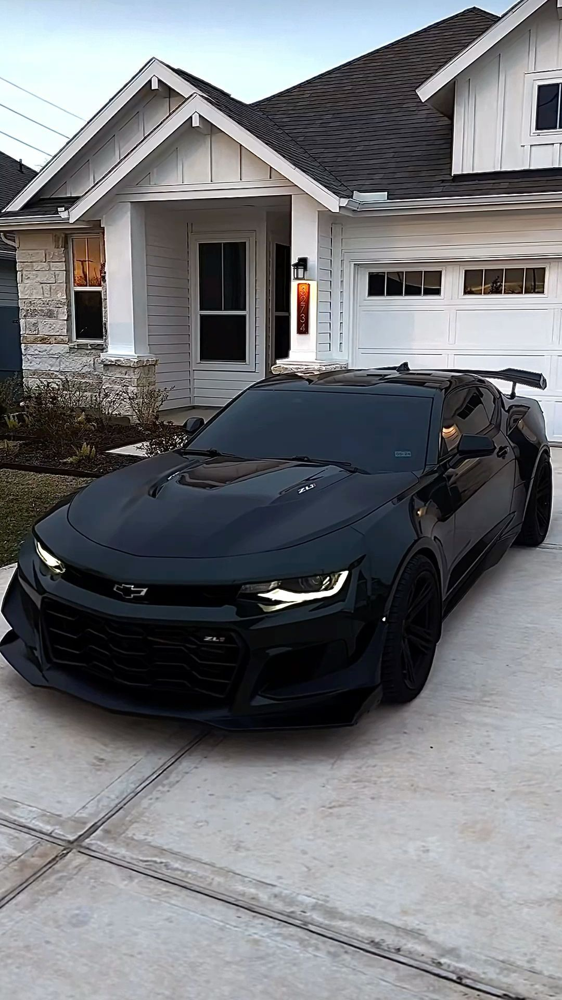

# 🎨 Neural Style Transfer with PyTorch

A modular implementation of **Neural Style Transfer (NST)** using a pretrained VGG19 network in PyTorch.

This project demonstrates how deep convolutional neural networks can be used not only for classification tasks, but also for **feature-based image optimization**.

Instead of training model weights, this implementation optimizes the pixels of an image directly using gradient descent, combining:

- 🖼 Content representation from one image  
- 🎨 Artistic style representation from another image  

The codebase is organized with a clean modular structure, making it suitable for learning, experimentation, and portfolio demonstration.

---

## 🖼 Visual Results

### Content Image



### Style Image


### Optimization Progress (GIF)


The GIF shows the progressive refinement of the target image during optimization.

Intermediate outputs are saved periodically and later combined into an animation to visualize convergence dynamics.

---

## 🧠 Problem Formulation

Given:

- A **content image** \( I_c \)
- A **style image** \( I_s \)

We aim to generate a new image \( I_t \) (target image) that preserves:

- The semantic structure of \( I_c \)
- The artistic texture and style of \( I_s \)

This is formulated as an optimization problem:

\[
I_t^* = \arg\min_{I_t} \; \mathcal{L}_{total}(I_t)
\]

Where the total loss is defined as:

\[
\mathcal{L}_{total} = \alpha \mathcal{L}_{content} + \beta \mathcal{L}_{style}
\]

- \( \alpha \) controls content preservation
- \( \beta \) controls stylistic influence

---

## 🔬 Theoretical Background

### 1️⃣ Content Representation

Content is captured using deep feature activations from a pretrained convolutional network (VGG).

Higher-level convolutional layers encode semantic structure while discarding low-level texture details.

Content loss is computed as:

\[
\mathcal{L}_{content} = \frac{1}{2} \| F_{target}^{l} - F_{content}^{l} \|^2
\]

Where:
- \( F^l \) represents feature maps from layer \( l \)

---

### 2️⃣ Style Representation

Style is represented using **Gram matrices**, which measure correlations between feature maps.

For a given layer:

\[
G^l = F^l (F^l)^T
\]

The Gram matrix captures texture patterns independent of spatial arrangement.

Style loss is computed as:

\[
\mathcal{L}_{style}^l = \frac{1}{4N_l^2M_l^2} \| G_{target}^l - G_{style}^l \|^2
\]

The final style loss is a weighted sum across multiple layers.

---

### 3️⃣ Optimization Strategy

Unlike traditional CNN training:

- Model weights remain frozen.
- The target image is treated as a trainable tensor.
- Gradients are computed with respect to the image pixels.

This demonstrates the flexibility of PyTorch’s autograd engine in optimizing arbitrary tensors.

---

## 🏗 Architecture Overview

The project follows a modular structure to ensure clarity, reusability, and separation of concerns.

```
src/
├── Train.py        # Main optimization loop
├── Model.py        # VGG loading & feature extraction
├── Losses.py       # Content, style, and total loss functions
├── Utils.py        # Image loading and visualization utilities
├── Create_gif.py   # Generates optimization animation from saved outputs
```

### Design Principles

- Clear separation between model, loss computation, and training loop  
- Reusable utility functions  
- No hard-coded logic inside the training loop  
- Structured for scalability and experimentation  

---

## 🔄 Training Workflow

1. Load pretrained VGG19 (frozen weights)
2. Extract content and style features
3. Compute Gram matrices for style
4. Initialize target image
5. Optimize the image using Adam
6. Save intermediate results periodically

The optimization runs for a fixed number of iterations and updates only the target image tensor while keeping the pretrained network weights frozen.


---

## 📂 Output Behavior

During training, the optimized image is saved at fixed intervals.

All generated images are stored inside the `outputs/` directory:

```
outputs/
├── iter_300.png
├── iter_600.png
├── iter_900.png
...
├── iter_10200.png
```

This allows:

- Visual comparison across iterations  
- Selection of the most aesthetically balanced result  
- Observation of convergence behavior  

After the optimization finishes:

- The final image is displayed automatically.
- All intermediate iterations remain stored inside `outputs/`.
- The saved frames can optionally be combined into a GIF using `Create_gif.py`.

---

## 📊 Convergence Insight

By saving intermediate outputs, the project enables analysis of:

- Style dominance vs content preservation
- Effect of weighting parameters (α, β)
- Stability of optimization over time

This design makes the repository suitable for experimentation and learning purposes.


---

## 🚀 How to Run

### 1️⃣ Clone the Repository

```bash
git clone https://github.com/yourusername/neural-style-transfer.git
cd neural-style-transfer
```

### 2️⃣ Install Dependencies

It is recommended to create and activate a virtual environment before installing dependencies.

```bash
pip install -r requirements.txt
```

### 3️⃣ Run the Training Script

```bash
python -m src.Train
```

Once executed:

- The optimization process will begin.
- Intermediate images will be saved automatically inside the `outputs/` directory.
- The final optimized image will be displayed after training completes.

### 4️⃣ (Optional) Generate Optimization GIF

```bash
python -m src.Create_gif
```
This script reads the images stored in `outputs/` and generates an animation showing the full optimization process.

---

## ⚙️ Configuration

The main hyperparameters can be adjusted directly inside `src/Train.py`.

### 🔧 Optimization Parameters

- `steps` → Total number of optimization iterations  
- `lr` → Learning rate for the Adam optimizer  
- `content_weight (α)` → Controls content preservation strength  
- `style_weight (β)` → Controls stylistic intensity  
- `save_every` → Frequency at which intermediate images are saved  

### 🖼 Image Parameters

- Path to content image  
- Path to style image  
- Target image resolution  

Modifying these parameters allows experimentation with different artistic outcomes and convergence behaviors.


---

## 📚 Acknowledgements

This project was inspired by the Neural Style Transfer implementation presented in the O'Reilly course:

**"PyTorch for Deep Learning and Computer Vision"**  
by Rayan Slim, Jad Slim, Amer Abdulkader, and Sarmad Tanveer.

The original educational material and source examples provided foundational guidance for understanding the algorithmic structure of Neural Style Transfer.

This repository, however, has been:

- Refactored into a modular architecture  
- Rewritten for clarity and maintainability  
- Extended to include structured output logging  
- Documented with detailed theoretical explanations  
- Adapted for portfolio and experimentation purposes  

All modifications and structural improvements were implemented independently for educational and professional demonstration.

The original course materials and related repositories can be found through O'Reilly Media and the instructors’ public GitHub profiles.


---

## 💼 Technical Highlights

This project demonstrates practical understanding of:

- Deep learning feature extraction using pretrained CNNs
- Implementation of Gram matrices for texture representation
- Custom loss function engineering (content + style losses)
- Optimization of non-model tensors using PyTorch autograd
- Proper use of `requires_grad` and in-place parameter updates
- Modular software design for machine learning workflows
- Structured experiment logging via intermediate image saving
- Clean project organization suitable for research and experimentation workflows

---

## 🧠 Skills Demonstrated

### 🔹 Deep Learning & Computer Vision
- CNN-based perceptual feature extraction
- Feature map correlation analysis
- Optimization-based image generation

### 🔹 PyTorch Proficiency
- Dynamic computational graphs
- Autograd engine usage
- Parameter vs tensor optimization
- Gradient-based iterative refinement

### 🔹 Software Engineering Practices
- Separation of concerns (Model / Loss / Training / Utils)
- Reproducible project structure
- Clear documentation for usability
- Ethical attribution of learning sources

---

## 👤 Author

Juan Joseph  
Electronic Engineering  
Deep Learning & AI Applications Enthusiast

